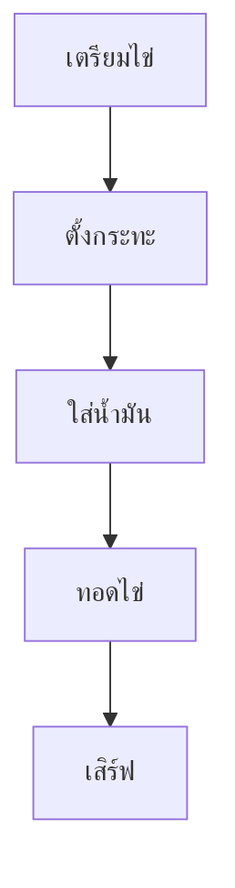
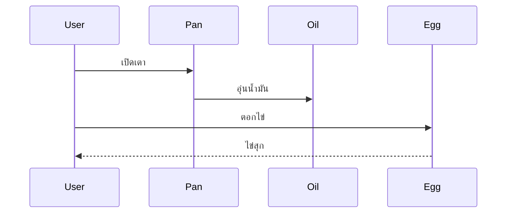

# คู่มือการทอดไข่ดาว 🍳

> ตัวอย่างไฟล์ Markdown ที่รวมลูกเล่นสำคัญสำหรับการเรียนรู้

---

## 1. หัวข้อ (Heading)

# Heading 1
## Heading 2
### Heading 3
#### Heading 4

---

## 2. การจัดรูปแบบตัวอักษร

ข้อความปกติ

**ตัวหนา**

*ตัวเอียง*

***หนาและเอียง***

~~ขีดฆ่า~~

`Inline Code`

---

## 3. รายการ (List)

### Bullet List

- ไข่ไก่ 1 ฟอง
- น้ำมันพืช
- กระทะ

### Nested List

- เตรียมอุปกรณ์
  - กระทะ
  - ตะหลิว
  - จาน

### Numbered List

1. ตั้งกระทะ
2. ใส่น้ำมัน
3. ตอกไข่
4. เสิร์ฟ

---

## 4. Checkbox

- [x] เตรียมไข่
- [x] เตรียมกระทะ
- [ ] ทอดไข่
- [ ] รับประทาน

---

## 5. Link

เว็บไซต์ Google

[Google](https://www.google.com)

เว็บไซต์ Github

[Github](https://github.com)

Link ภายในเอกสาร

[ไปหัวข้อสรุป](#สรุป)

---

## 6. รูปภาพ

### รูปจากอินเทอร์เน็ต


### รูปจาก Folder ภายใน Project


โครงสร้าง

project/
├─ docs/
│  ├─ example.md
│  └─ images/
│     └─ fried_egg.jpg

---

## 7. ตาราง (Table)

| ขั้นตอน | เวลา | หมายเหตุ |
|----------|------|----------|
| ตั้งกระทะ | 1 นาที | ใช้ไฟกลาง |
| ใส่น้ำมัน | 30 วินาที | ไม่มากเกินไป |
| ทอดไข่ | 2 นาที | ตามความสุก |

---

## 8. Code Block

### Python

```python
print("Hello Markdown")
```

### C++

```cpp
#include <iostream>

int main() {
    std::cout << "Hello World";
    return 0;
}
```

### JSON

```json
{
  "name": "robot",
  "speed": 1.5
}
```

---

## 9. Block Quote

> ไข่ดาวที่ดีต้องใช้อุณหภูมิที่เหมาะสม
>
> - Chef AI

---

## 10. เส้นคั่น

---

***

___

---

## 11. สมการคณิตศาสตร์ (Math)

Inline Formula

$E = mc^2$

Block Formula

$$
v = r \omega
$$

$$
PID = K_p e + K_i \int e dt + K_d \frac{de}{dt}
$$

---

## 12. Emoji

😀 😎 🚀 🤖 📚 🍳

---

## 13. HTML แทรกใน Markdown

<font color="red">ข้อความสีแดง</font>

<font color="blue">ข้อความสีน้ำเงิน</font>

<center>
ข้อความกึ่งกลาง
</center>

---

## 14. Admonition (MkDocs Material)

!!! note "หมายเหตุ"
    ใช้สำหรับข้อมูลเพิ่มเติม

!!! warning "คำเตือน"
    ระวังน้ำมันกระเด็น

!!! tip "เคล็ดลับ"
    ใช้ไข่สดจะสวยกว่า

---

## 15. Collapse (MkDocs Material)

??? note "คลิกเพื่อดูเฉลย"

    ไข่ดาวกรอบควรใช้ไฟกลางค่อนแรง

---

## 16. Mermaid Diagram



---

## 17. Mindmap


---

## 18. Sequence Diagram



---

## 19. Callout

> [!NOTE]
> ใช้ได้บน GitHub

> [!TIP]
> ใช้ไข่สด

> [!WARNING]
> ระวังน้ำมันร้อน

---

## 20. Footnote

ไข่ดาวเป็นอาหารยอดนิยม[^1]

[^1]: ตัวอย่าง Footnote

---

## สรุป

Markdown สามารถใช้สร้าง

- หนังสือ
- เอกสารประกอบการสอน
- เว็บไซต์เอกสาร
- Slide Presentation
- Technical Documentation
- Research Report
- Thesis